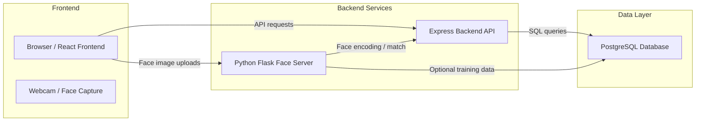

# System Architecture

This document describes the architecture of the Gym DBMS application, showing how the frontend, backend, database, and face recognition server work together.

## Components

- `frontend/`
  - React + Vite + Tailwind application
  - Admin dashboard and face check-in user interface
  - Communicates with the backend API and face recognition server

- `backend/`
  - Node.js + Express REST API
  - Handles authentication, member/trainer management, attendance, payments, and plans
  - Connects to PostgreSQL via `pg`

- `database/`
  - PostgreSQL schema initialization
  - Core tables: `admins`, `members`, `plans`, `trainers`, `attendance`, `payments`

- `face_server/`
  - Python Flask service
  - Runs facial recognition and encodes face data for the backend
  - Receives webcam images from frontend and returns matching results

## Architecture Diagram

## Data Flow

1. The admin logs in through the React frontend.
2. The frontend sends authentication requests to the Express backend.
3. The backend validates credentials and returns a JWT.
4. Member registration and profile updates are sent to the backend and persisted in PostgreSQL.
5. When a member uses face check-in, the frontend captures an image from the webcam.
6. The image is posted to the Python face server to extract and compare facial encodings.
7. The face server responds with a matching result and confidence score.
8. The backend stores attendance records and optionally updates member status or payment records.

## Deployment

- `docker-compose.yml` launches PostgreSQL and initializes the schema.
- The backend is typically hosted separately from the frontend.
- The face recognition service runs in its own Python environment.
- The frontend can be served as a static app or run locally in development mode.

## Key Integration Points

- `frontend/src/api.js` or equivalent client code calls backend endpoints.
- `backend/src/config/db.js` configures PostgreSQL connection.
- `face_server/app.py` exposes endpoints for face encoding and matching.
- `database/schema.sql` defines the data model that links members, attendance, payments, plans, and trainers.

## Notes

- Keep API keys and secrets out of source control.
- For production, use HTTPS, secure JWT storage, and replace default credentials.
- Use container orchestration or separate services for scaling backend and face server independently.
